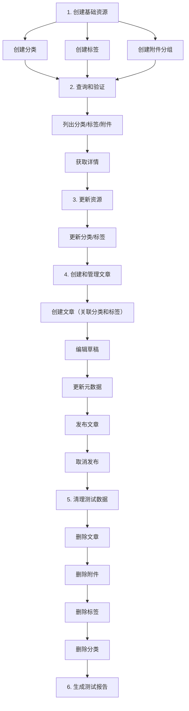

# Halo MCP Server 测试指南

本目录包含 Halo MCP Server 的所有测试代码和文档。

## 📁 文件结构

```
tests/
├── README.md                          # 本文件 - 测试指南
├── conftest.py                        # Pytest 配置和 fixtures
├── run_comprehensive_test.py          # 综合测试套件（主要测试文件）
└── README_COMPREHENSIVE_TEST.md       # 综合测试详细文档
```

## 🎯 测试概述

### 综合测试套件

**文件**: [`run_comprehensive_test.py`](run_comprehensive_test.py)

全面覆盖所有 30 个 MCP 工具的集成测试：

- ✅ **分类管理** (6个工具): create_category, list_categories, get_category, update_category, get_category_posts, delete_category
- ✅ **标签管理** (7个工具): create_tag, list_tags, get_tag, update_tag, list_console_tags, get_tag_posts, delete_tag
- ✅ **附件管理** (8个工具): list_attachment_groups, create_attachment_group, get_attachment_policies, upload_attachment, list_attachments, get_attachment, delete_attachment, 等
- ✅ **文章管理** (9个工具): create_post, list_my_posts, get_post, get_post_draft, update_post_draft, update_post, publish_post, unpublish_post, delete_post

## 🚀 快速开始

### 方式一：直接运行（推荐）

```bash
# 进入 tests 目录
cd tests

# 运行综合测试
python run_comprehensive_test.py
```

**优点**：
- ✅ 无需安装额外依赖
- ✅ 即开即用
- ✅ 详细的控制台输出

### 方式二：使用 Pytest

```bash
# 安装 pytest（如果尚未安装）
pip install pytest pytest-asyncio pytest-ordering

# 运行所有测试
pytest -v -s

# 运行指定测试文件
pytest run_comprehensive_test.py -v -s
```

**优点**：
- ✅ 标准化的测试框架
- ✅ 丰富的报告选项
- ✅ 更好的测试组织

## 📊 测试流程

综合测试按照以下顺序执行，模拟真实的博客管理场景：



## ⚙️ 环境配置

### 必需环境变量

测试需要以下环境变量：

```bash
# Halo 服务器地址
export HALO_BASE_URL="http://localhost:8091"

# Halo 访问令牌
export HALO_TOKEN="your_access_token_here"
```

或者在项目根目录创建 `.env` 文件：

```env
HALO_BASE_URL=http://localhost:8091
HALO_TOKEN=your_access_token_here
MCP_LOG_LEVEL=INFO
```

### 可选配置

```bash
# 日志级别
export MCP_LOG_LEVEL="DEBUG"  # DEBUG, INFO, WARNING, ERROR

# 请求超时（秒）
export MCP_TIMEOUT="30"
```

## 📝 测试用例详解

### 1. 分类管理测试 (测试 1-5)

#### 测试 1: `create_category`
**目的**: 创建博客分类  
**验证**: 分类创建成功，返回分类标识符  
**数据**: 创建 1 个测试分类

#### 测试 2: `list_categories`
**目的**: 列出所有分类  
**验证**: 能够查询到刚创建的分类  
**断言**: 分类列表包含测试分类

#### 测试 3: `get_category`
**目的**: 获取分类详情  
**验证**: 返回完整的分类信息  
**检查**: 分类名称、描述、优先级等字段

#### 测试 4: `update_category`
**目的**: 更新分类信息  
**验证**: 成功修改分类属性  
**操作**: 更新描述和优先级

#### 测试 5: `get_category_posts`
**目的**: 查询分类下的文章  
**验证**: 返回文章列表（可能为空）  
**说明**: 新创建的分类通常没有文章

### 2. 标签管理测试 (测试 6-11)

#### 测试 6: `create_tag`
**目的**: 创建博客标签  
**验证**: 标签创建成功  
**数据**: 创建 2 个测试标签（不同颜色）

#### 测试 7: `list_tags`
**目的**: 列出所有标签  
**验证**: 标签列表正常返回  

#### 测试 8: `get_tag`
**目的**: 获取标签详情  
**验证**: 返回完整的标签信息  

#### 测试 9: `update_tag`
**目的**: 更新标签  
**验证**: 成功修改标签颜色  

#### 测试 10: `list_console_tags`
**目的**: 列出控制台标签  
**验证**: 后台标签列表正常  

#### 测试 11: `get_tag_posts`
**目的**: 查询标签下的文章  
**验证**: 返回文章列表  

### 3. 附件管理测试 (测试 12-17)

#### 测试 12-13: 附件分组
**操作**: 列出和创建附件分组  
**验证**: 分组管理功能正常  

#### 测试 14: `get_attachment_policies`
**目的**: 查询存储策略  
**验证**: 返回可用的存储策略列表  

#### 测试 15: `upload_attachment`
**目的**: 上传本地文件  
**验证**: 文件上传成功  
**测试文件**: 创建临时文本文件

#### 测试 16-17: 附件查询
**操作**: 列出附件和获取附件详情  
**验证**: 附件信息完整  

### 4. 文章管理测试 (测试 18-25)

#### 测试 18: `create_post`
**目的**: 创建博客文章  
**内容**: Markdown 格式的测试文章  
**关联**: 使用前面创建的分类和标签  
**验证**: 文章创建成功

#### 测试 19: `list_my_posts`
**目的**: 列出用户文章  
**验证**: 能找到刚创建的文章  

#### 测试 20: `get_post`
**目的**: 获取文章详情  
**验证**: 返回完整的文章内容和元数据  

#### 测试 21: `get_post_draft`
**目的**: 获取文章草稿  
**验证**: 返回可编辑的草稿版本  

#### 测试 22: `update_post_draft`
**目的**: 更新草稿内容  
**操作**: 修改文章 Markdown 内容  
**验证**: 草稿更新成功

#### 测试 23: `update_post`
**目的**: 更新文章元数据  
**操作**: 修改摘要、置顶状态等  
**验证**: 元数据更新成功

#### 测试 24: `publish_post`
**目的**: 发布文章  
**流程**: 草稿 → 已发布  
**验证**: 文章状态变为已发布

#### 测试 25: `unpublish_post`
**目的**: 取消发布  
**流程**: 已发布 → 草稿  
**验证**: 文章状态变回草稿

### 5. 清理测试 (测试 26-29)

按顺序删除所有测试数据：
1. 删除文章
2. 删除附件
3. 删除标签
4. 删除分类

## 📈 测试报告

### 控制台输出示例

```
================================================================================
🚀 开始 Halo MCP Server 全面测试
================================================================================
✓ 客户端初始化成功

================================================================================
测试 1/30: create_category - 创建博客分类
================================================================================
✓ 测试 1 通过: create_category

... (中间测试省略) ...

================================================================================
🎉 测试总结
================================================================================

总测试数: 30
✓ 通过: 30
✗ 失败: 0

创建的资源:
  - 分类: 1
  - 标签: 2
  - 附件: 1
  - 文章: 1
  - 分组: 1

================================================================================
```

### 生成 HTML 报告

使用 pytest 可以生成详细的 HTML 测试报告：

```bash
# 安装报告插件
pip install pytest-html

# 生成报告
pytest run_comprehensive_test.py --html=report.html --self-contained-html
```

## 🐛 故障排除

### 常见问题

#### 问题 1: 连接失败

**错误信息**:
```
Error: Failed to connect to Halo server
```

**解决方案**:
1. 检查 `HALO_BASE_URL` 配置是否正确
2. 确认 Halo 服务器正在运行
3. 测试网络连接: `curl http://localhost:8091`

#### 问题 2: 认证失败

**错误信息**:
```
Error: Authentication failed
```

**解决方案**:
1. 检查 `HALO_TOKEN` 是否有效
2. 在 Halo 后台重新生成令牌
3. 确认令牌权限包含所需的 API 访问权限

#### 问题 3: 测试跳过

**提示信息**:
```
Warning: 没有可用的分类/标签/附件
```

**说明**:
- 这是正常现象
- 某些测试依赖前序测试创建的资源
- 如果前序测试失败，后续测试会被跳过

#### 问题 4: 文件上传失败

**错误信息**:
```
Error: Failed to upload attachment
```

**解决方案**:
1. 检查 Halo 存储策略配置
2. 确认磁盘空间充足
3. 验证文件系统权限

### 调试技巧

#### 1. 启用详细日志

```bash
# 设置 DEBUG 级别日志
export MCP_LOG_LEVEL=DEBUG
python run_comprehensive_test.py
```

#### 2. 运行单个测试

修改 `run_comprehensive_test.py` 中的 `run_all_tests` 方法，只运行需要的测试：

```python
async def run_all_tests(self):
    await self.setup()
    try:
        # 只运行需要测试的部分
        await self.test_01_create_category()
        await self.test_02_list_categories()
        # ... 注释掉其他测试
    finally:
        await self.teardown()
```

#### 3. 保留测试数据

如果需要手动检查测试数据，注释掉清理代码：

```python
# 注释掉清理步骤
# await self.test_26_delete_post()
# await self.test_27_delete_attachment()
# await self.test_28_delete_tag()
# await self.test_29_delete_category()
```

## 🔧 扩展测试

### 添加自定义测试

你可以在 `run_comprehensive_test.py` 中添加自己的测试方法：

```python
async def test_custom_scenario(self):
    """自定义测试场景"""
    from halo_mcp_server.tools.post_tools import create_post_tool
    
    self.log_test(31, "custom_test", "我的自定义测试")
    
    try:
        # 你的测试逻辑
        args = {
            "title": "自定义测试文章",
            "content": "测试内容"
        }
        
        result = await create_post_tool(self.client, args)
        # ... 验证逻辑
        
        self.record_result(31, "custom_test", True, "测试通过")
    except Exception as e:
        self.record_result(31, "custom_test", False, str(e))
```

然后在 `run_all_tests` 方法中调用：

```python
async def run_all_tests(self):
    # ... 现有测试 ...
    await self.test_custom_scenario()
```

## 📚 相关文档

- **[综合测试详细文档](README_COMPREHENSIVE_TEST.md)** - 更详细的测试说明
- **[使用示例](../examples/usage_examples.md)** - 工具使用示例
- **[快速开始示例](../examples/quick_start_example.md)** - 快速入门指南
- **[主 README](../README.md)** - 项目总览
- **[API 文档](../halo_apis_docs/apis.md)** - Halo API 参考

## 💡 最佳实践

### 1. 测试前准备

- ✅ 确保 Halo 服务器正常运行
- ✅ 配置正确的环境变量
- ✅ 备份重要数据（如果在生产环境测试）

### 2. 测试中注意

- ✅ 观察控制台输出，及时发现问题
- ✅ 记录失败的测试用例
- ✅ 检查创建的测试数据是否正确

### 3. 测试后检查

- ✅ 验证测试数据已清理
- ✅ 检查测试报告
- ✅ 记录遇到的问题和解决方案

## 🤝 贡献测试

欢迎贡献新的测试用例！请遵循以下步骤：

1. **Fork 项目**
2. **创建测试分支**: `git checkout -b feature/new-test`
3. **添加测试代码**: 在 `run_comprehensive_test.py` 中添加新测试
4. **运行测试**: 确保所有测试通过
5. **提交代码**: `git commit -m "Add new test for XXX"`
6. **推送分支**: `git push origin feature/new-test`
7. **创建 Pull Request**

## 📊 测试覆盖率

当前测试覆盖情况：

| 模块 | 工具数 | 已测试 | 覆盖率 |
|------|--------|--------|--------|
| 文章管理 | 9 | 9 | 100% ✅ |
| 分类管理 | 6 | 6 | 100% ✅ |
| 标签管理 | 7 | 7 | 100% ✅ |
| 附件管理 | 8 | 8 | 100% ✅ |
| **总计** | **30** | **30** | **100%** ✅ |

## ❓ 获取帮助

如果遇到问题：

1. 📖 查看 [FAQ](../README.md#常见问题)
2. 🔍 搜索 [Issues](https://github.com/Huangwh826/halo-mcp-server/issues)
3. 💬 提出新的 [Issue](https://github.com/Huangwh826/halo-mcp-server/issues/new)
4. 📧 联系维护者

---

**祝测试顺利！** 🎉

如果这个测试套件对你有帮助，欢迎给项目 [⭐ Star](https://github.com/Huangwh826/halo-mcp-server) 支持！
